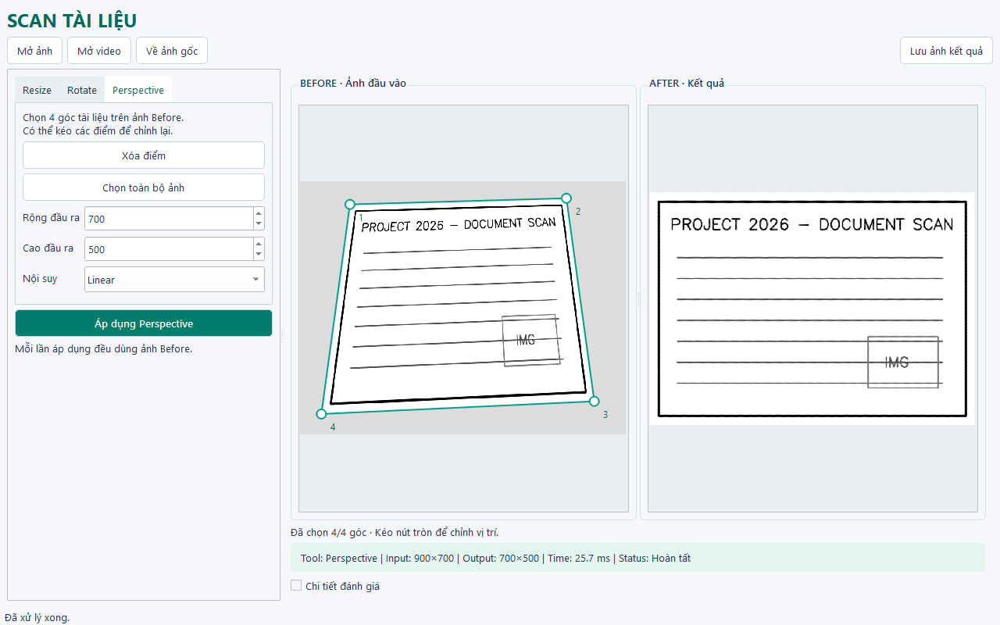

# Ứng dụng Scan tài liệu

Project môn **Xử lý ảnh – Chủ đề 4, Project 1**. Ứng dụng mở ảnh hoặc lấy một khung hình video, cho người dùng chỉnh ảnh bằng Resize, Rotate và Perspective Transform rồi lưu kết quả.



## Công nghệ

- Python 3.11 trở lên.
- PySide6: giao diện desktop, cố định light mode với Fusion.
- OpenCV và NumPy: xử lý ảnh.
- scikit-image: tính SSIM cho Resize.

## Ba kỹ thuật chính

| Kỹ thuật | Cách làm | Tham số |
|---|---|---|
| Resize | Thay đổi kích thước bằng `cv2.resize` | Scale hoặc Width/Height, giữ tỷ lệ, nội suy |
| Rotate | Tạo ma trận xoay rồi dùng `cv2.warpAffine` | Góc, scale, giữ toàn bộ ảnh, nội suy |
| Perspective | Đưa bốn góc tài liệu về hình chữ nhật bằng `cv2.warpPerspective` | Bốn điểm trên ảnh, kích thước đầu ra, nội suy |

Thuật toán được chuyển từ hai notebook của nhóm. Rotate mở rộng khung ảnh khi bật Keep Full để tránh cắt góc. Perspective tự sắp xếp bốn điểm và báo lỗi nếu điểm trùng hoặc không tạo thành tứ giác hợp lệ.

## Cấu trúc source

```text
main.py                       Chạy ứng dụng
requirements.txt              Thư viện cần cài
scan_app/
    window.py                 Dựng giao diện và xử lý các nút bấm
    canvas.py                 Hiển thị ảnh, click/kéo bốn góc
    image_io.py               Đọc/ghi ảnh, hỗ trợ đường dẫn tiếng Việt
    processing/
        __init__.py           Hằng số, kiểm tra đầu vào, metric dùng chung
        resize.py             Resize và đánh giá
        rotate.py             Rotate
        perspective.py        Perspective và đánh giá
tests/                        Kiểm thử; reference/ chứa hàm gốc từ notebook
docs/                         Ghi chú source và kết quả kiểm thử
samples/synthetic/            Ảnh tài liệu mô phỏng để chạy thử
scripts/generate_demo.py       Tạo lại bộ ảnh mô phỏng
```

Luồng chương trình: nút **Áp dụng** lấy tham số → `TransformWorker` gọi hàm xử lý → `show_result` hiện ảnh After và thông số. Worker chạy riêng để cửa sổ vẫn phản hồi khi xử lý ảnh lớn. Không có tầng controller/service.

## Cài đặt và chạy

Mở PowerShell tại thư mục project:

```powershell
py -m venv .venv
.\.venv\Scripts\python.exe -m pip install -r requirements.txt
.\.venv\Scripts\python.exe main.py
```

Nếu đã có môi trường `.venv`, chỉ cần chạy dòng cuối. Có thể mở sẵn ảnh mẫu:

```powershell
.\.venv\Scripts\python.exe main.py samples/synthetic/document_01.png
```

## Cách sử dụng

1. Bấm **Mở ảnh**. Với **Mở video**, nhập số khung hình rồi bấm **Lấy khung hình**.
2. Chọn tab **Resize**, **Rotate** hoặc **Perspective**. Màn hình chỉ hiện tham số của tab đang chọn.
3. Với Resize: chọn Scale hoặc Width/Height. Khi giữ tỷ lệ, sửa một chiều sẽ cập nhật chiều còn lại theo ảnh Before.
4. Với Rotate: nhập góc và scale. Góc dương xoay ngược chiều kim đồng hồ. **Keep Full Image** được bật mặc định.
5. Với Perspective: click bốn góc tài liệu trên **Before**, kéo điểm để chỉnh. Bấm **Xóa điểm** để chọn lại hoặc **Chọn toàn bộ ảnh**. Kích thước đầu ra mặc định là **Tự động**; có thể nhập rộng/cao bằng pixel.
6. Bấm **Áp dụng**, so sánh **Before/After**. Thanh bên dưới hiển thị tool, kích thước vào/ra, thời gian và trạng thái. Mở **Chi tiết đánh giá** khi cần xem thêm.
7. **Lưu ảnh kết quả** lưu ảnh After gần nhất, hỗ trợ PNG/JPEG/BMP/TIFF. **Về ảnh gốc** xóa kết quả và điểm đã chọn.

Mỗi phép biến đổi luôn dùng ảnh Before; không tự nối nhiều bước. Rotate/Perspective dùng nền trắng và nội suy Linear mặc định. App giữ nền sáng cả khi Windows dùng Dark Mode.

## Đánh giá kết quả

- Resize: MSE, PSNR và SSIM sau khi đưa ảnh kết quả về kích thước ban đầu bằng Linear. Đây là phép đo mất mát do thay đổi kích thước, không phải so sánh với ảnh chuẩn độc lập.
- Rotate: xem kích thước, góc, scale và thời gian; không so PSNR trực tiếp giữa hai ảnh khác hướng.
- Perspective: xem độ sắc nét, tỷ lệ diện tích chọn và sai số ánh xạ bốn góc trong mục chi tiết. Sai số nhỏ không có nghĩa là người dùng đã chọn đúng mép giấy.

## Kiểm thử

```powershell
.\.venv\Scripts\python.exe -m pip install -r requirements-dev.txt
.\.venv\Scripts\python.exe -m pytest -q
```

Xem [kết quả kiểm thử](docs/KIEM_THU.md), [hướng dẫn đọc source](docs/REVIEW_GUIDE.md) và [những thay đổi](docs/THAY_DOI.md). Các phiên bản thư viện đã dùng được ghi trong `requirements-lock.txt`.

Bộ ảnh trong `samples/` là ảnh mô phỏng, chưa thay thế đánh giá trên ảnh chụp thực tế. Video chỉ dùng để lấy khung hình, không xuất video đã xử lý. Đề `Project_2026.pdf` và hai notebook đầy đủ không nằm trong repository; nguồn hàm được ghi ở `docs/source_manifest.json`. Báo cáo học phần và video thuyết trình cần được nhóm chuẩn bị riêng.
